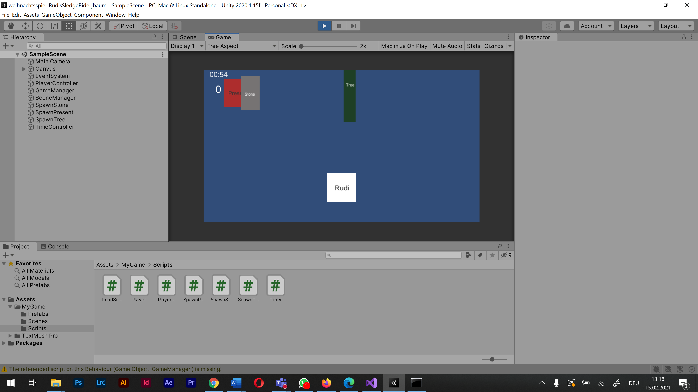

# weihnachtsspiel-RudisSledgeRide-jbaum

### Project description: 
Rudi the elf slides down the snow track on his sledge and has to collect the lost presents on his way to Father Christmas. In doing so, he has to avoid some obstacles such as trees and stones (bad objects). If he collides with a bad object, such as a tree, he loses one of the presents he has already collected. In the top left corner there is a counter that counts the collected gifts and a timer that shows the remaining time. After the time has expired (1 minute), all the presents that Rudi has collected with his sledge and not lost are counted.

### Development platform: 
(Windows, Unity 2020.1.15f1, Visual Studio 2019, used SDKs)

### Target platform: 
WebGL, Ref,Res 960x600, screen independent, VR Device incl. reference resolution 

### Visuals: 

    

### Necessary setup/execution steps: 
Installation process, e.g. step by step instructions that I can run the project after cloning it

### Third party material: 
(if used Fonts, Sounds, Music, Graphics, Materials, Code etc.)

### Project state: 
mvp

### Limitations: 

### Lessons Learned: 

C# (timer, if statements, Player movement, Scene Controll, Drop Controll)

Copyright by jbaum
